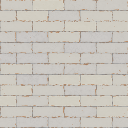

# Заголовок 1
## Заголовок 2
### Заголовок 3
___
* А это точка
---
- и это тоже
---
+ Плюс тоже работает
  + Табуляцией можно вложенные фрагменты делать
  + да-да
---
Для того чтобы сделать абзац  
Нужно поставить два пробела в конце предыдущей строки

---
* **жирный**
* *курсив*
* ***курсив с жиром***

---
`обратная кавычка делает вот как`

---

```
А это блок целый
```
---
>цитата  
> с переносом

---
[Ссылка. Тут текст пишешь](https://www.youtube.com/watch?v=jCjuXf4WPrQ)

---
Картинка:



---
